<!-- README.md is generated from README.Rmd. Please edit that file -->

```{r, include = FALSE}
knitr::opts_chunk$set(
  collapse = TRUE,
  comment = "#>"
)
```

# Collections of figures in the article

## Figure 3

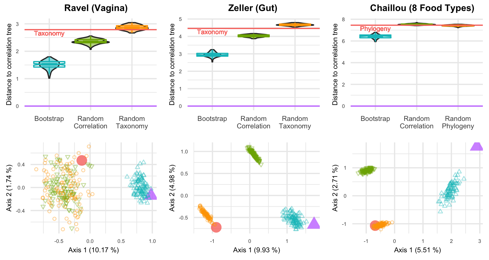

## Figure 4

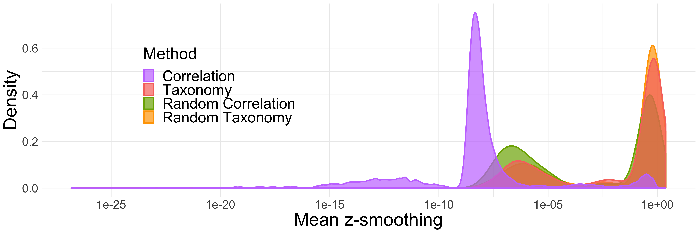

## Figure 5

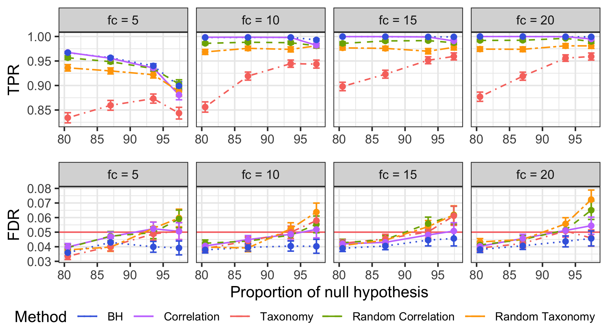

## Figure 6

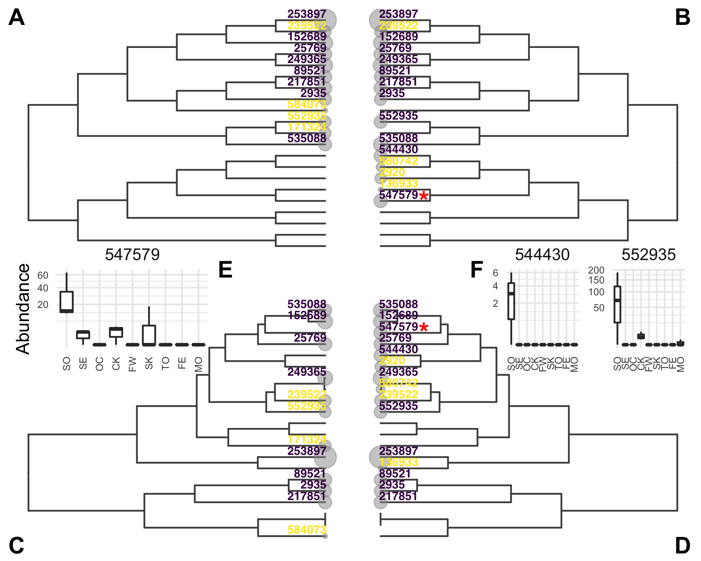

## Figure 7

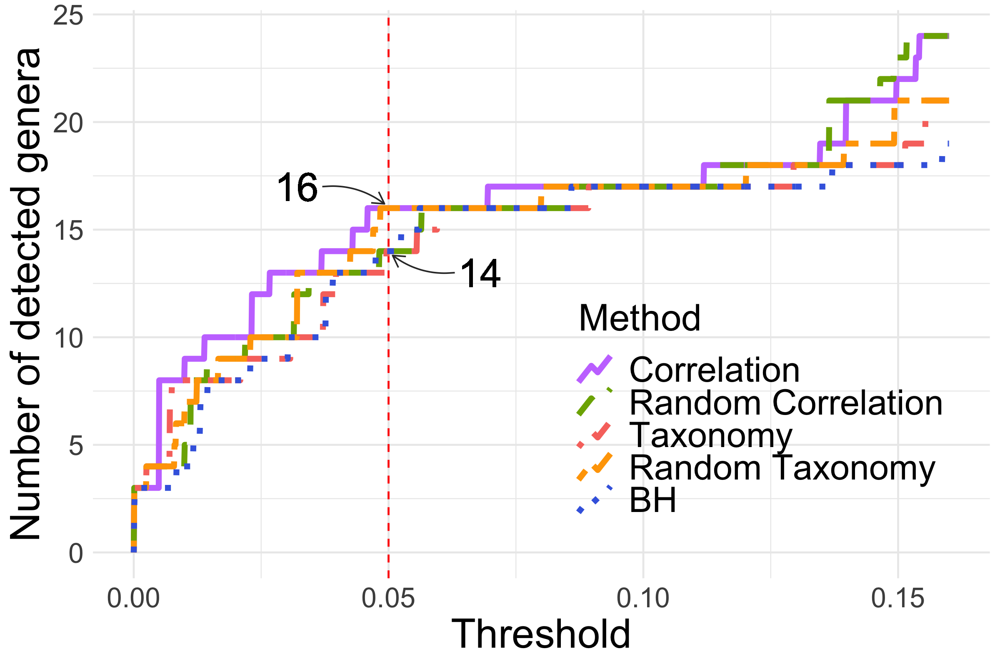


## Figure S1

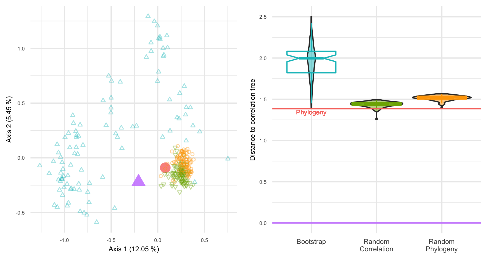

## Figure S2

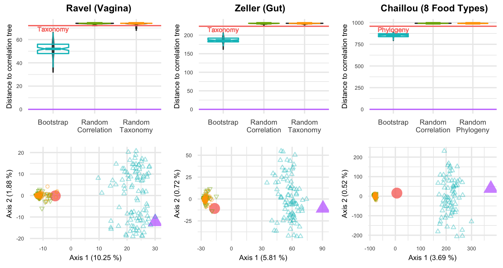

## Figure S3

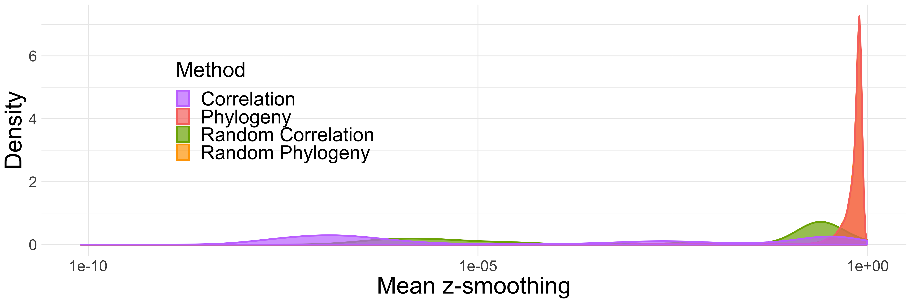

## Figure S4

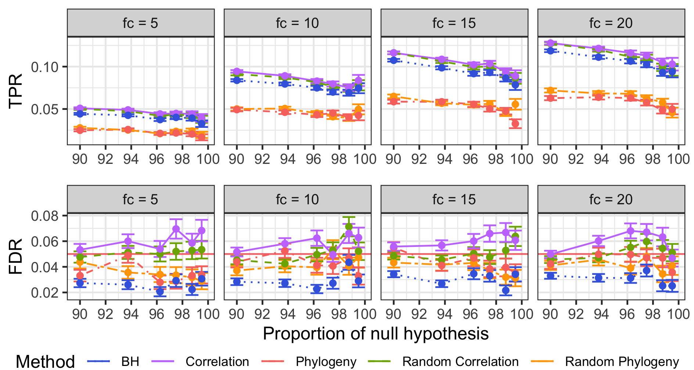

## Figure S5

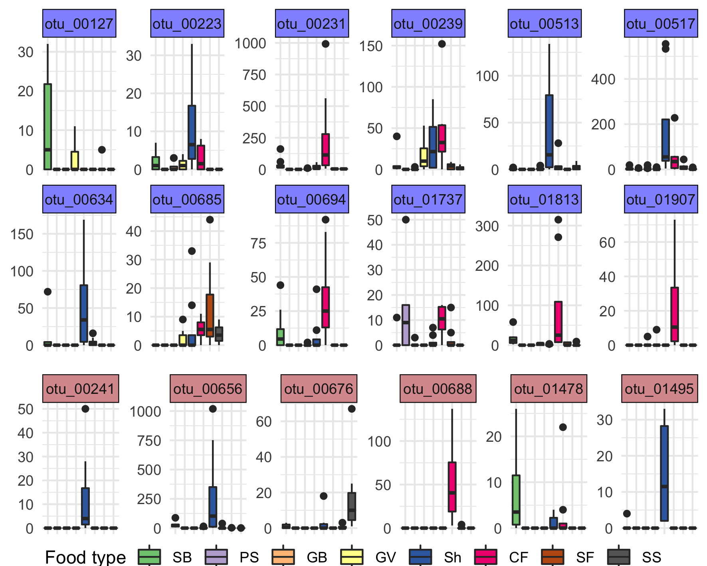

## Figure S6

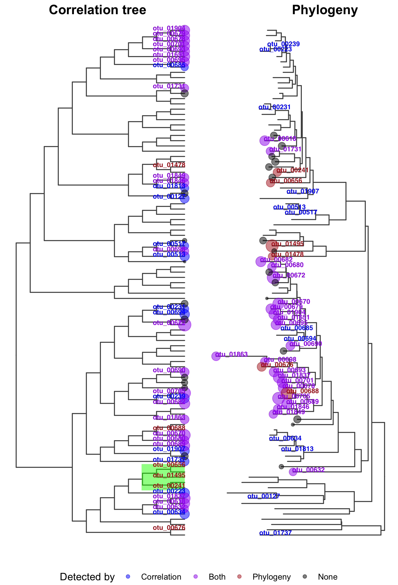

## Figure S7

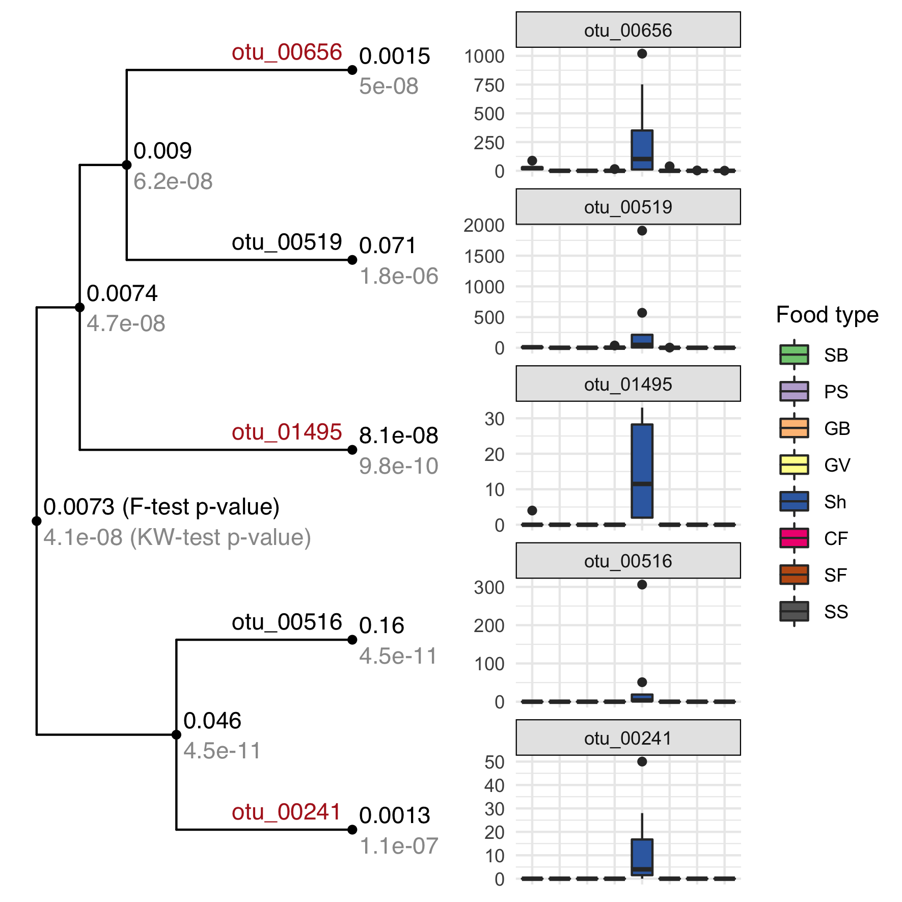

## Figure S8

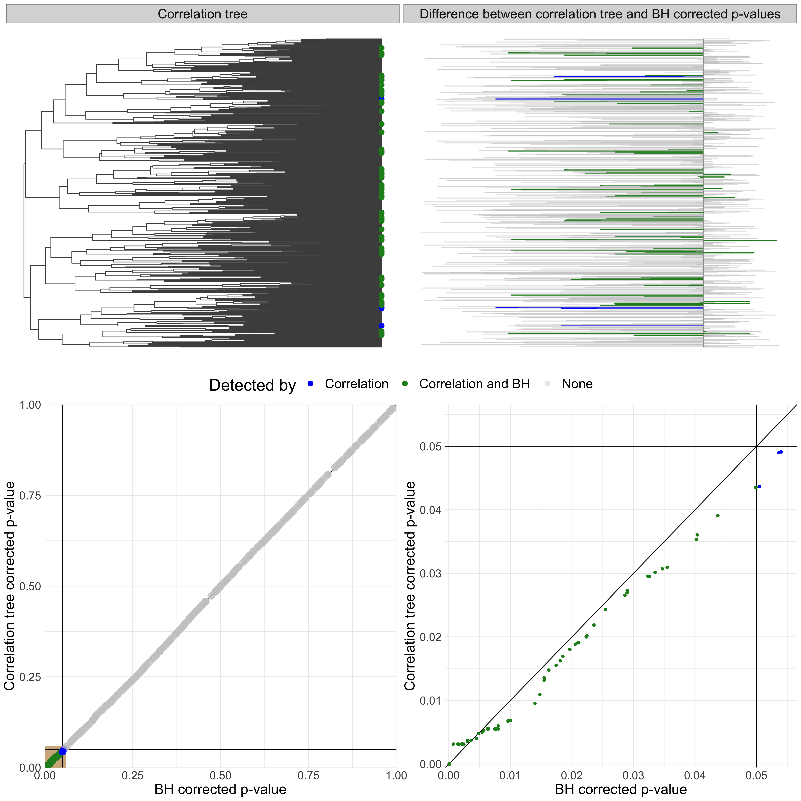
