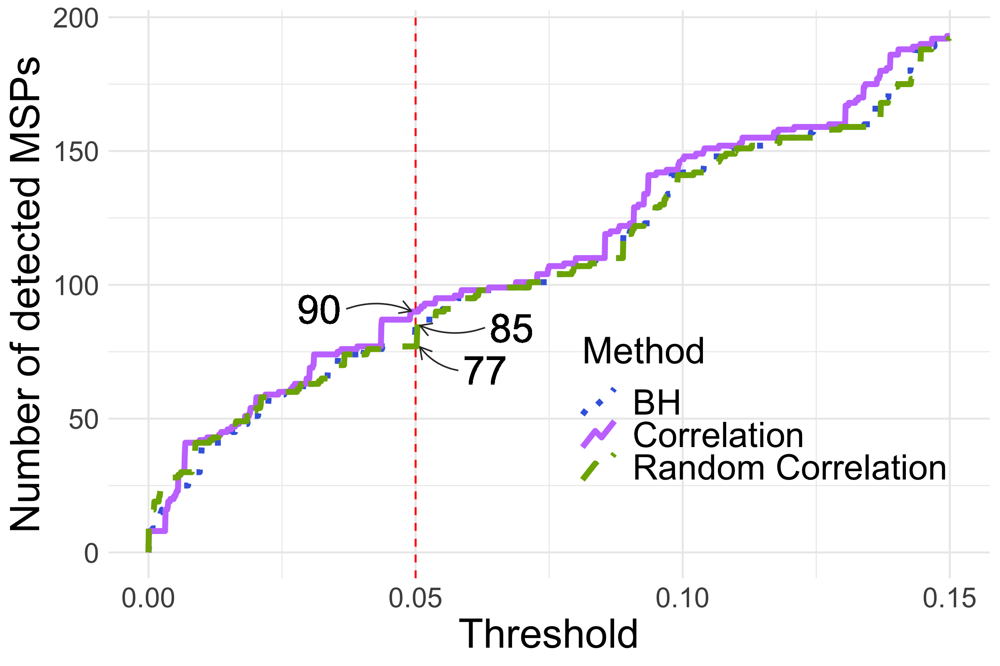

<!-- README.md is generated from README.Rmd. Please edit that file -->

```{r, include = FALSE}
knitr::opts_chunk$set(
  collapse = TRUE,
  comment = "#>"
)
```

# Collections of figures in the article

## Figure 3


## Figure 4


## Figure 5


## Figure 6


## Figure 7




## Figure S1


## Figure S2


## Figure S3


## Figure S4


## Figure S5


## Figure S6


## Figure S7


## Figure S8


