<!-- README.md is generated from README.Rmd. Please edit that file -->

```{r, include = FALSE}
knitr::opts_chunk$set(
  collapse = TRUE,
  comment = "#>"
)
```

# The Taxonomy Differs from the Correlation Tree

## Chaillou


## Chlamydiae

### BHV

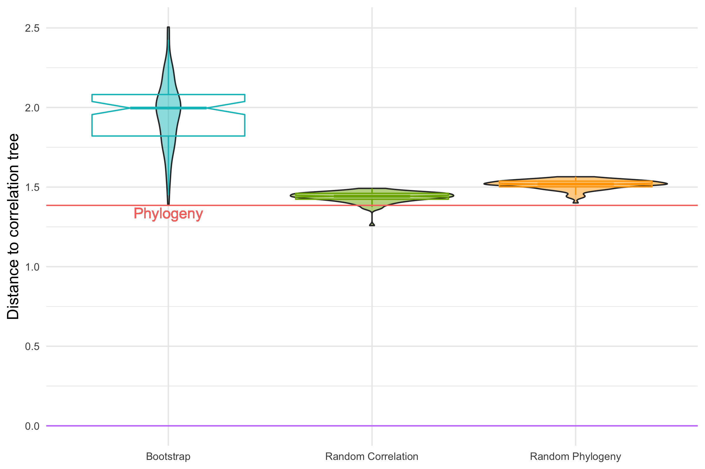
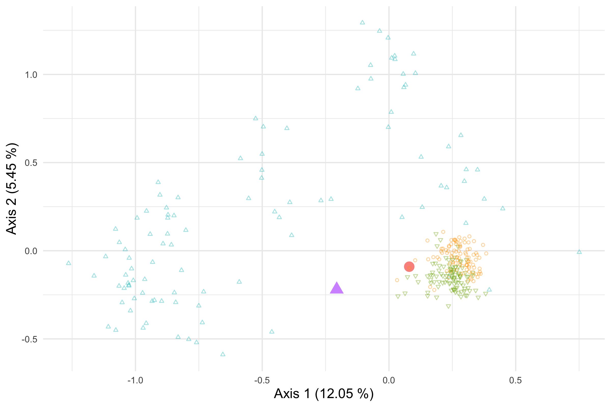

### RF

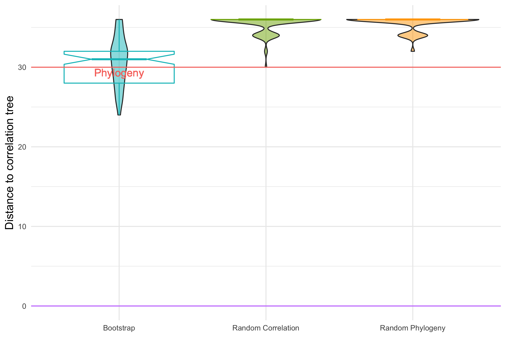
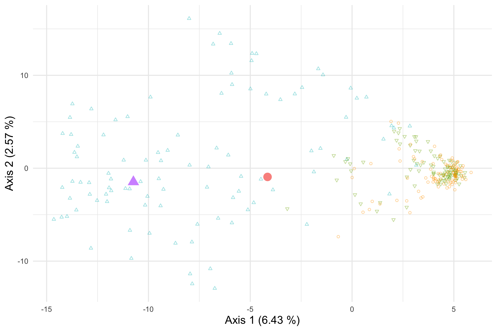

## Ravel

### BHV

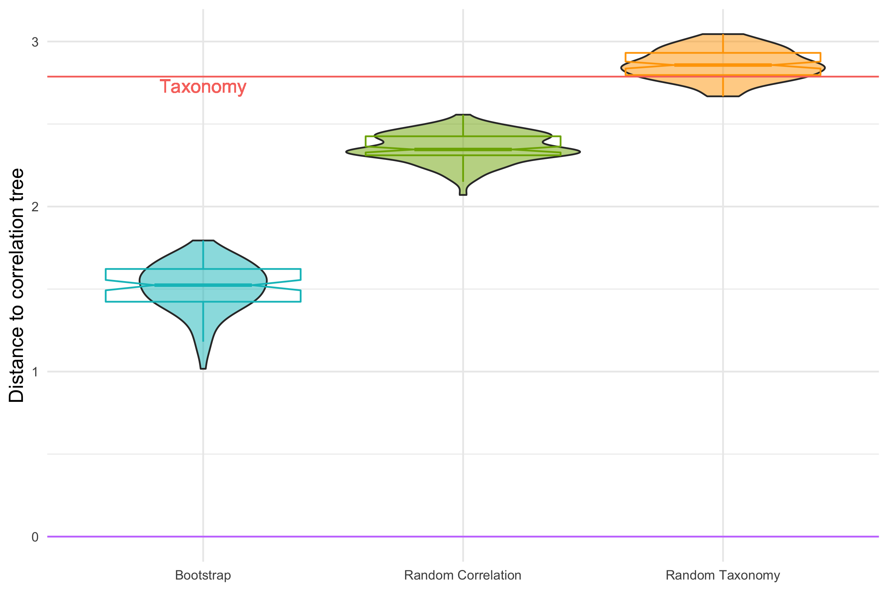
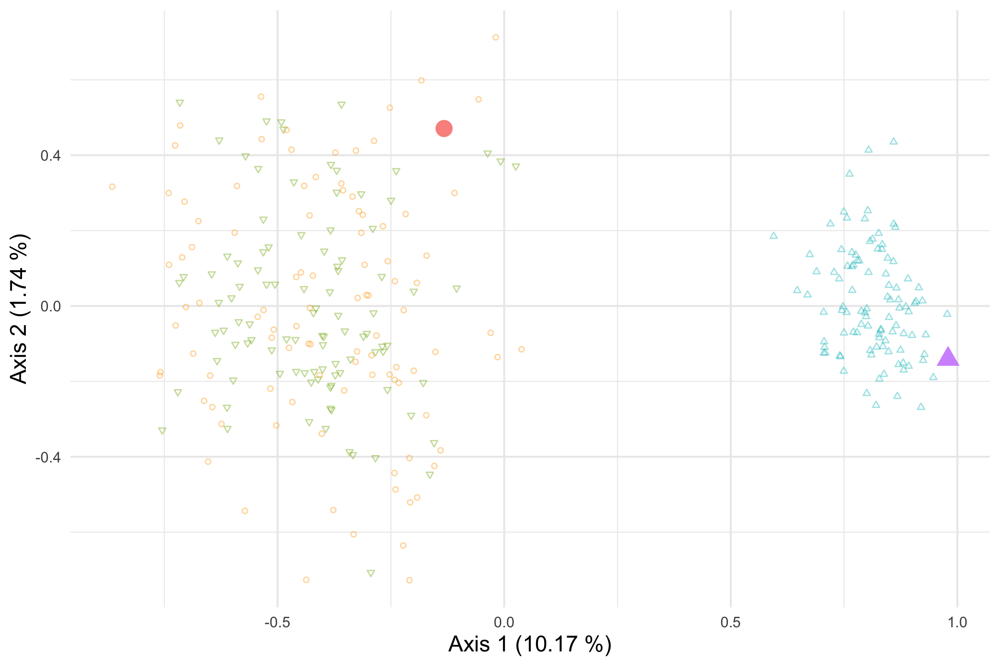

### RF

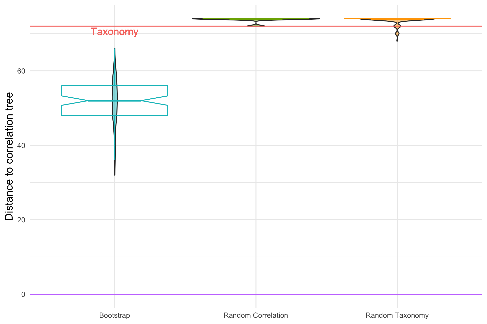
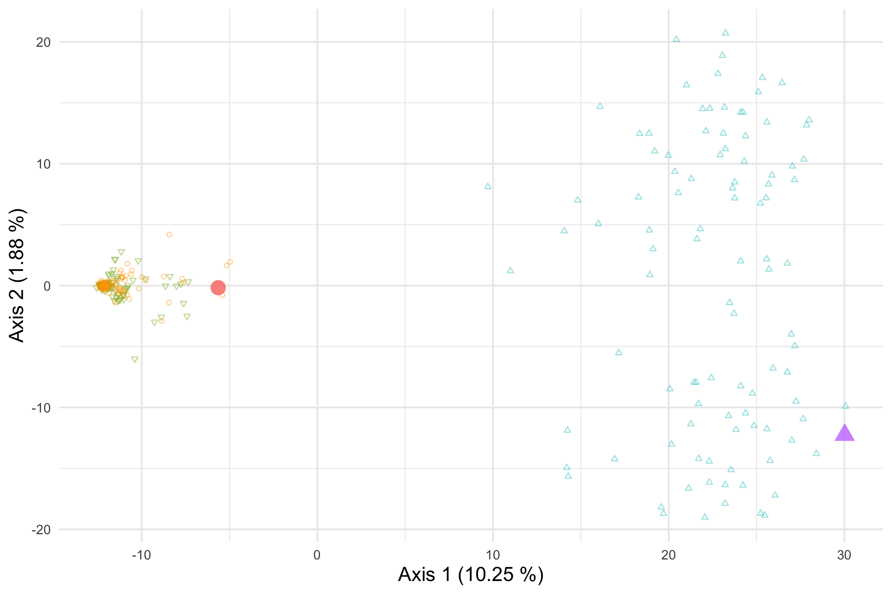

## Zeller

### BHV

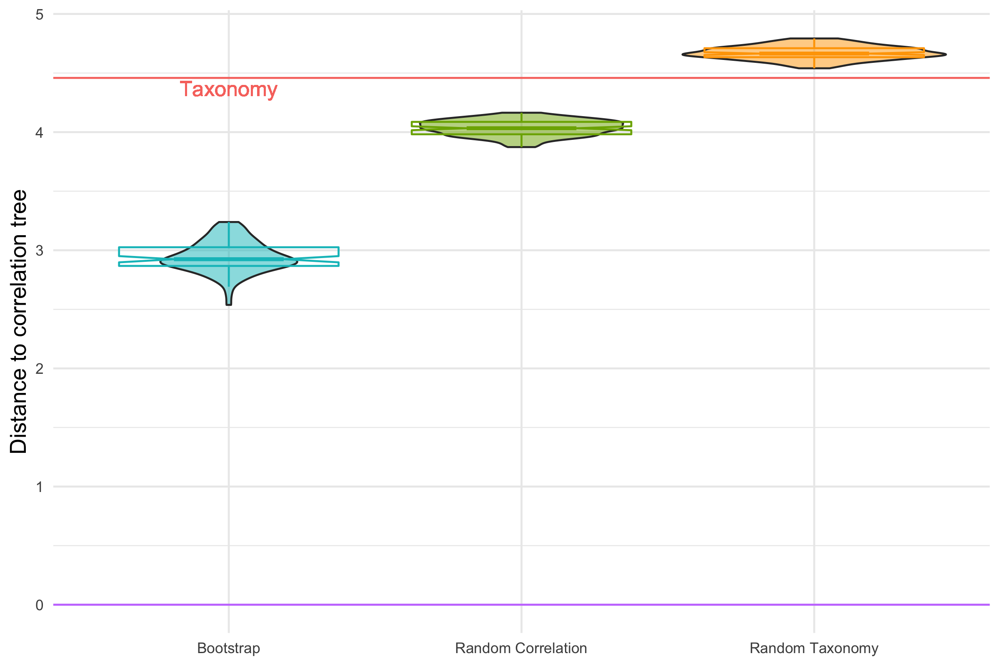
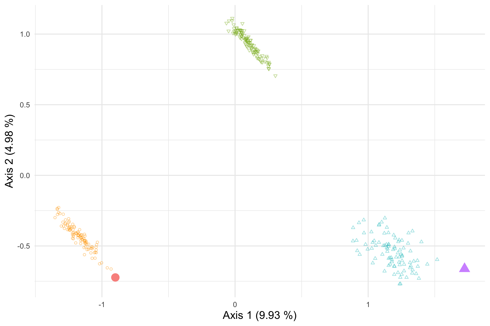

### RF

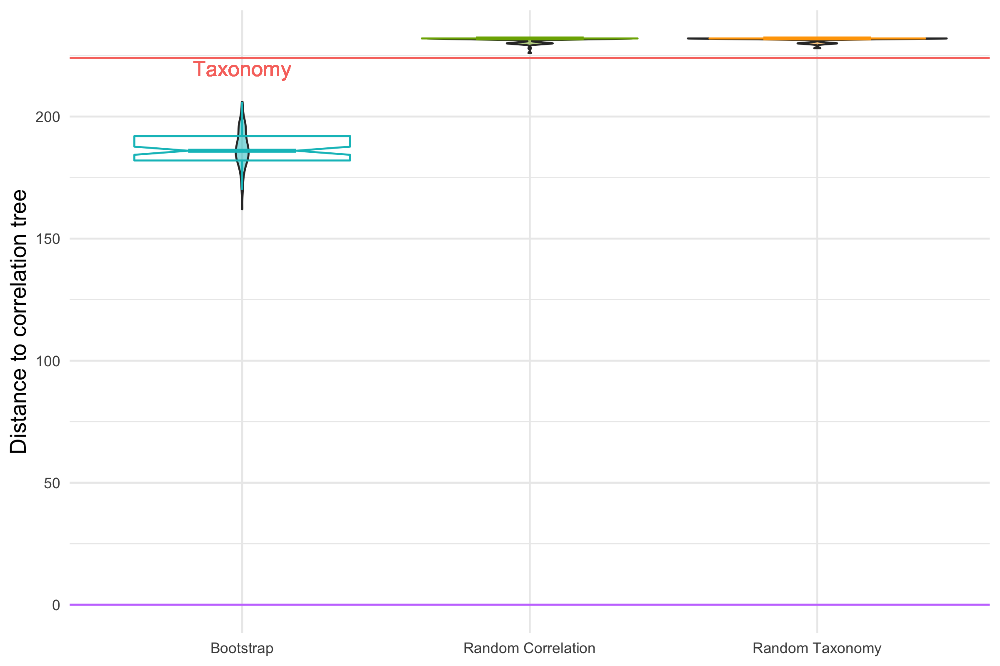
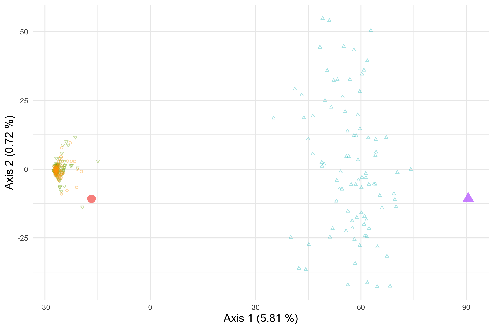

