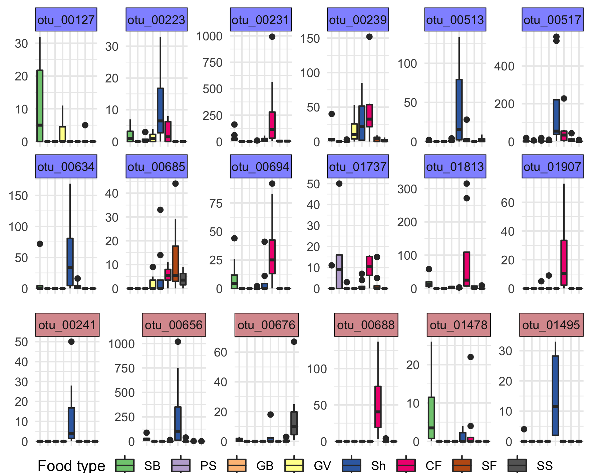
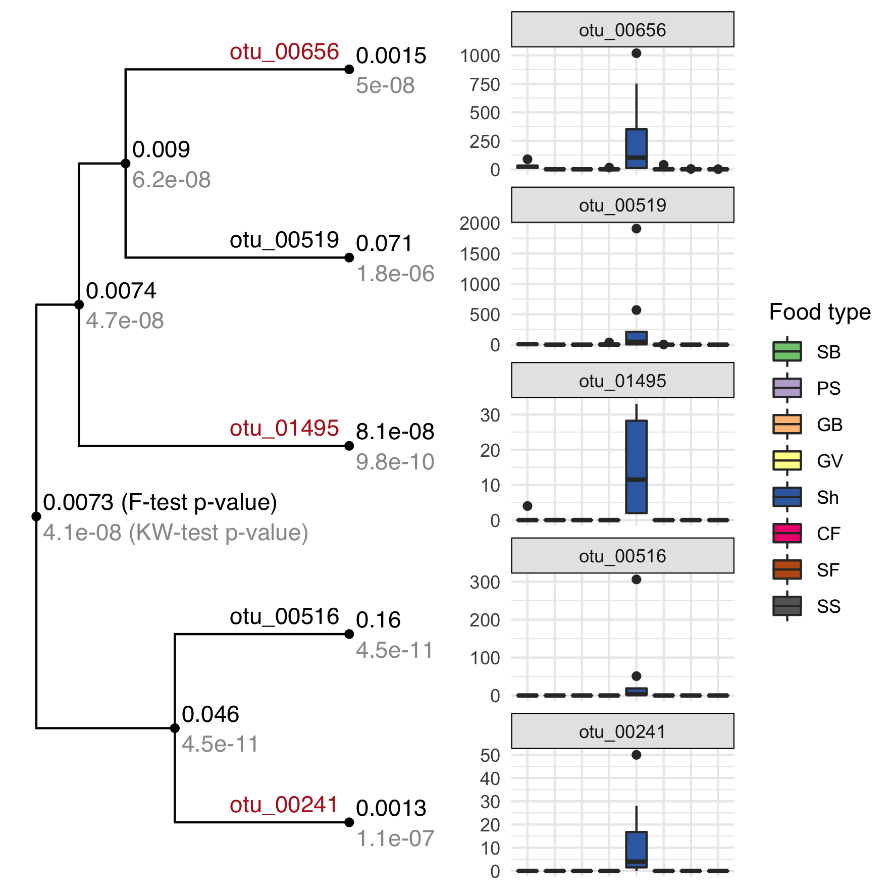
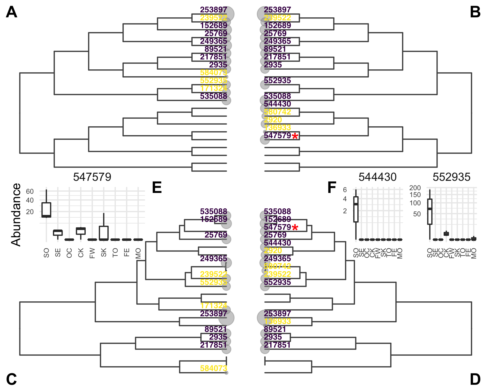
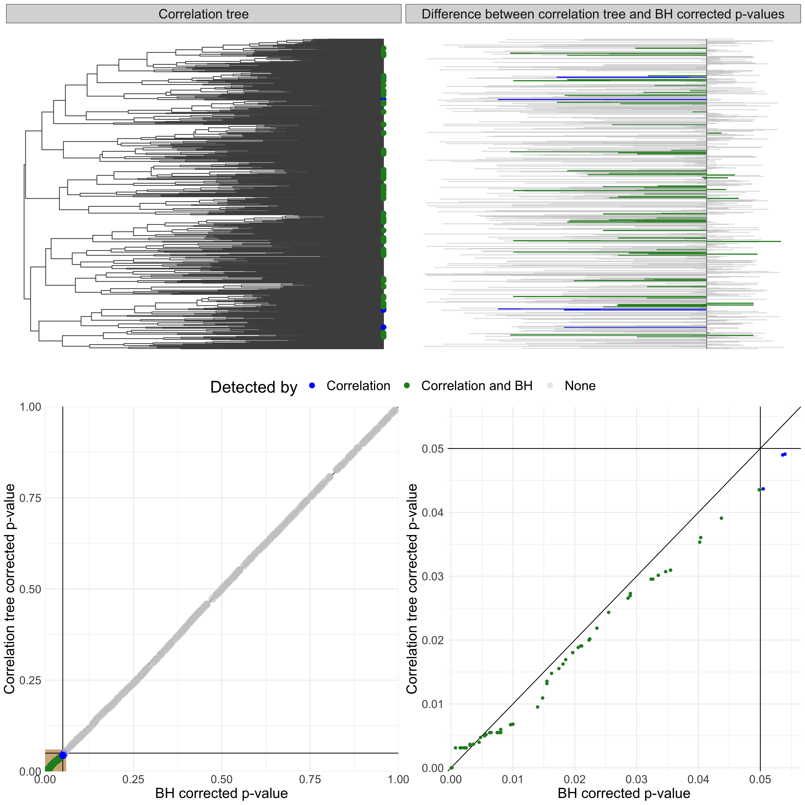

<!-- README.md is generated from README.Rmd. Please edit that file -->

```{r, include = FALSE}
knitr::opts_chunk$set(
  collapse = TRUE,
  comment = "#>"
)
```

# Analysis of real datasets

## Chaillou





## Chlamydiae



## Zeller (genus)


## Zeller (MSP)



